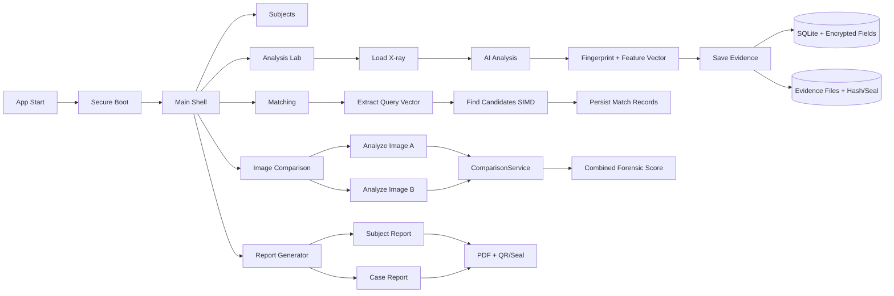
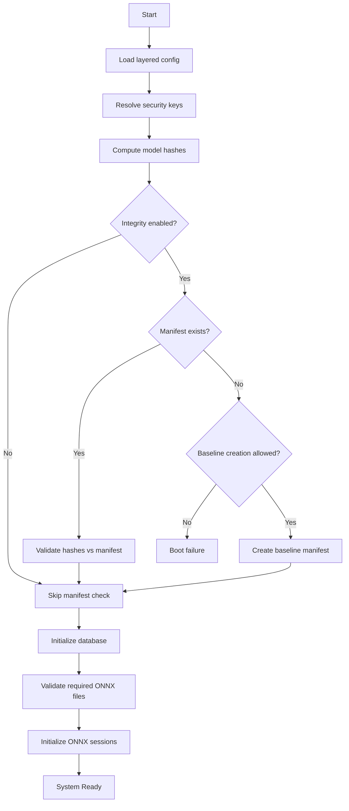
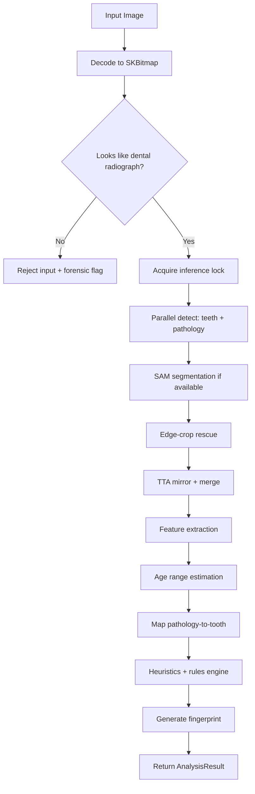
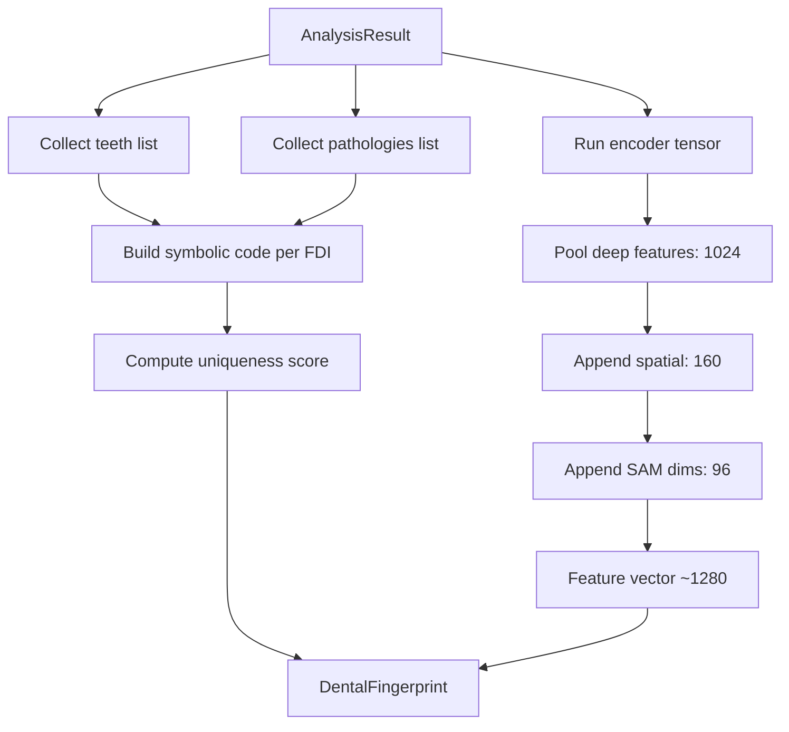
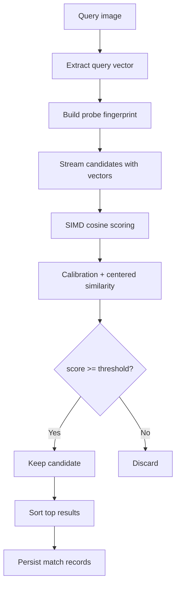
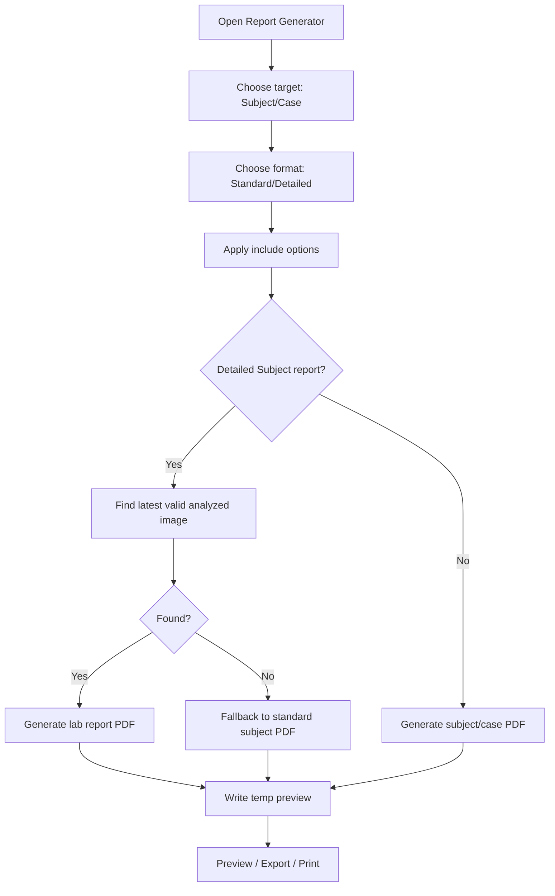
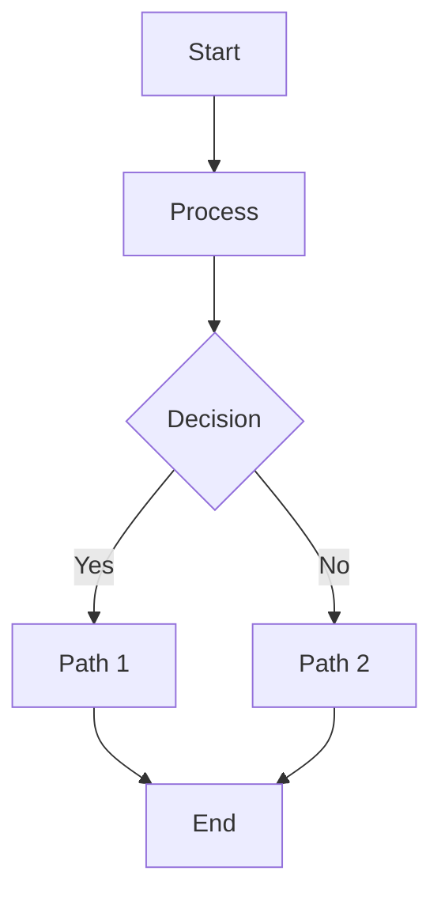

# الفصل الرابع: المعمارية التشغيلية والتحليل الخوارزمي المتقدم لمنظومة **DentalID** في الطب الشرعي السني

## 4.1 مقدمة محدثة
تُعرَّف منظومة **DentalID** في وضعها الحالي كنظام طب شرعي سني مكتبي متكامل، مبني على:
- **.NET 10**
- **C#**
- **Avalonia UI (11.3.x)** عبر نمط **MVVM**
- سلسلة نماذج ONNX للكشف والتحليل

المنظومة لا تقتصر على كشف الأسنان والآفات، بل تنفّذ دورة جنائية كاملة تشمل:
- الإقلاع الآمن والتحقق من نزاهة النماذج قبل التشغيل.
- تحليل شعاعي آلي مع مرشحات جنائية وقواعد اتساق بيولوجي.
- استخراج بصمة رقمية سنية (رمزية + متجهية).
- المطابقة البيومترية والمقارنة الصورية.
- حفظ الأدلة بختم رقمي وتوليد تقارير PDF قابلة للتوثيق القضائي.

---

## 4.2 المعمارية الفعلية للنظام (Current Architecture)

### 4.2.1 التقسيم الطبقي (Clean Architecture)
يعتمد النظام التقسيم التالي على مستوى المشاريع:

| الطبقة | المشروع | المسؤولية |
|---|---|---|
| النطاق | `DentalID.Core` | الكيانات، العقود، DTOs، enums |
| التطبيق | `DentalID.Application` | منطق التحليل، المطابقة، الاستدلال، قواعد الطب الشرعي |
| البنية التحتية | `DentalID.Infrastructure` | EF Core + SQLite، التشفير، المستودعات، توليد PDF |
| العرض | `DentalID.Desktop` | Avalonia UI + ViewModels + التنقل + UX |

### 4.2.2 وحدات الواجهة الفعلية (Presentation Modules)
الوحدات الرئيسية داخل واجهة التطبيق:
- `SubjectsViewModel` لإدارة السجلات.
- `AnalysisLabViewModel` للتحليل التفاعلي وحفظ الأدلة.
- `MatchingViewModel` للمطابقة 1:N.
- `ImageComparisonViewModel` للمقارنة صورة-بصورة.
- `ReportGeneratorViewModel` لتوليد التقارير (Subject/Case).
- `SettingsViewModel` و`ImportWizardViewModel` للإعدادات والاستيراد.

### 4.2.3 الخدمات الجوهرية في طبقة التطبيق
الخدمات المركزية الحالية:
- `OnnxInferenceService` كـ Facade للتحليل.
- `OnnxSessionManager` لإدارة جلسات ONNX ومزودات التنفيذ.
- `TeethDetectionService` و`PathologyDetectionService`.
- `SamSegmentationService` لتحديد الحدود الشكلية (outline/masks).
- `FeatureEncoderService` لاستخراج المتجه الرقمي.
- `BiometricService` لبناء الكود السني الرمزي.
- `MatchingService` للمطابقة المتجهية SIMD.
- `ForensicAnalysisService` لأتمتة التحليل الجنائي والحفظ المحمي.
- `ForensicHeuristicsService` و`ForensicRulesEngine` لضبط الاتساق.
- `ComparisonService` للمقارنة الجنائية بين تحليلين.

---

## 4.3 بروتوكول الإقلاع الآمن (Secure Boot) في الوضع الحالي
التطبيق يمر بمسار إقلاع متسلسل عبر `Bootstrapper` قبل السماح بالعمل:

1. **بناء الإعدادات متعددة الطبقات**:
   - `appsettings.json`
   - `appsettings.Development.json`
   - متغيرات البيئة ذات البادئة `DENTALID_`

2. **إدارة مفاتيح الأمان**:
   - تحميل/توليد `SealingKey` (أولوية لمتغير البيئة `DENTALID_SEALING_KEY`).
   - دعم التخزين المحلي الآمن للمفتاح.

3. **التحقق من نزاهة النماذج**:
   - حساب SHA-256 لكل نموذج.
   - مطابقة القيم مع Manifest (`data/model_integrity.json`) عند تفعيل التحقق.
   - إمكانية إنشاء baseline عند التشغيل الأول إذا كان ذلك مسموحًا.

4. **تهيئة قاعدة البيانات**:
   - إنشاء/تهيئة SQLite عبر EF Core.
   - تحميل البذور الأساسية.

5. **تهيئة محرك الذكاء الاصطناعي**:
   - التحقق من الملفات الحرجة (`teeth_detect.onnx`, `pathology_detect.onnx`, `encoder.onnx`).
   - اختبار صلاحية النموذج.
   - تحميل الجلسات وتفعيل حالة الجاهزية.

---

## 4.4 حالات تدفق البيانات (Data Flow States)

### 4.4.1 حالات شاشة الإقلاع
داخل `StartupViewModel`:
- `Pending`
- `Validating`
- `Verified`
- `Loading`
- `Ready`
- `Error`

### 4.4.2 آلة حالات مختبر التحليل
داخل `AnalysisState`:
- `Idle`
- `LoadingImage`
- `Ready`
- `Analyzing`
- `Review`
- `Error`
- `Saving`

هذه الآلة الحالتية تمنع الانتقالات غير المنطقية (مثل حفظ نتيجة قبل اكتمال التحليل).

### 4.4.3 دورة حالة الدليل الجنائي (Evidence Lifecycle)
الدورة العملية للبيانات من الإدخال حتى التوثيق:
1. `InputAcquired`: تحميل الصورة.
2. `Validated`: التحقق من صلاحية التنسيق ومجال الصورة الشعاعي.
3. `AnalyzedRaw`: إنتاج الكشف الخام (أسنان/آفات).
4. `AnalyzedRefined`: تطبيق TTA/Rescue/NMS والقواعد الجنائية.
5. `Fingerprinted`: إنتاج الكود والمتجه.
6. `Sealed`: حساب الختم الرقمي.
7. `Persisted`: حفظ الملف والبيانات بمعاملة متسقة.
8. `Reportable`: جاهزية التقرير والتصدير.

---

## 4.5 خط أنابيب التحليل العصبي (AI Inference Pipeline)

### 4.5.1 التحقق من إدخال الصورة
في `ForensicAnalysisService`:
- فك الصورة إلى `SKBitmap`.
- رفض الصور غير الشعاعية عبر اختبار grayscale/saturation (تقليل إدخالات خارج المجال).

### 4.5.2 تجهيز التنسورات (Tensor Preparation)
في `TensorPreparationService`:
- Letterbox/Resize مع الحفاظ على النسب.
- تطبيع القيم.
- مسار قراءة ذاكرة مباشر (unsafe pointers) لتقليل زمن المعالجة.

### 4.5.3 الكشف الأولي (YOLO)
- كشف الأسنان: `TeethDetectionService`.
- كشف الآفات: `PathologyDetectionService`.
- التفسير والفلترة: `YoloDetectionParser` مع:
  - Score normalization
  - NMS
  - فحص معقولية هندسية للصناديق

### 4.5.4 التقسيم الدقيق (SAM)
في `SamSegmentationService`:
- استخدام `sam_encoder.onnx` و`sam_decoder.onnx` عند توفرهما.
- إنتاج outlines وقياسات mask (`MaskWidth`, `MaskHeight`, `MaskArea`).
- fallback ضمني عند عدم توفر SAM (النظام يكمل التحليل دون إيقاف).

### 4.5.5 آليات الإنقاذ والتحسين
- **Edge-Crop Rescue** لاستعادة الأسنان الطرفية غير المكتشفة.
- **TTA** (انعكاس أفقي) مع تصحيح إحداثيات X وإعادة تعيين رباعيات FDI.
- دمج نتائج متعددة ثم إعادة NMS.

### 4.5.6 ما بعد المعالجة (Post-processing)
بعد الكشف:
- ربط الآفات بالأسنان (`MapPathologiesToTeeth`).
- تطبيق heuristics (`ForensicHeuristicsService`).
- تطبيق قواعد تعارض سريري (`ForensicRulesEngine`) مثل:
  - تعارض Implant مع Caries/Root Canal/Filling.
- استخراج الاستبصارات الذكية وحساب مؤشرات الصحة (`DentalIntelligenceService`).
- توليد البصمة (`BiometricService`).

---

## 4.6 استخراج البصمة الرقمية (Digital Fingerprint Extraction)

### 4.6.1 البصمة الرمزية (Symbolic Dental Code)
`BiometricService` يولّد كودًا لكل FDI باستخدام رموز مثل:
- `H`: Healthy
- `I`: Implant
- `B`: Bridge
- `C`: Crown
- `R`: Root canal obturation
- `F`: Filling
- `K`: Caries
- `M`: Missing
- `U`: Unknown

صيغة الناتج:  
`18:H-17:F-16:C-...`

مع حساب `UniquenessScore` مرجّحًا بحسب الأهمية الجنائية للصفة.

### 4.6.2 البصمة المتجهية (Feature Vector)
في `FeatureEncoderService`، وبناءً على الحالة الحالية للكود:

1. **Deep Features من SAM Encoder**  
   عادةً: `1024` بعد mean-pooling الرباعي.

2. **Spatial Geometry Features**  
   `160` = (32 سن × 5 سمات: confidence, x, y, w, h).

3. **SAM Dimension Features**  
   `96` = (32 سن × 3 سمات: mask width, mask height, mask area).

إذًا الصيغة التشغيلية الحديثة تميل إلى متجه بطول:
- **`1280 = 1024 + 160 + 96`**

ملاحظة توافقية مهمة بحثيًا:
- `MatchingService` ما يزال يحتوي مسارًا خاصًا عندما يكون الطول **1184** (تقسيم 1024/160 بوزن 75/25).
- إذا كان الطول مختلفًا (مثل 1280)، تُستخدم cosine similarity الكاملة على كامل المتجه.

### 4.6.3 الصياغة الرياضية للمطابقة المتجهية
للحالة `1184`:
\[
S_{hybrid}=0.75 \cdot \cos(\mathbf{v}_{deep}^a,\mathbf{v}_{deep}^b)+0.25 \cdot \max(0,\cos(\mathbf{v}_{spatial}^a,\mathbf{v}_{spatial}^b))
\]

مع معايرة إضافية داخل `MatchingService`:
- Floor/Gamma calibration.
- Centered similarity حول centroid لتقليل التشابه الخلفي العام.

---

## 4.7 المطابقة والمقارنة الجنائية

### 4.7.1 المطابقة 1:N (Probe vs Database)
في `MatchingViewModel` + `MatchingService`:
1. استخراج متجه الصورة المجهولة.
2. بناء probe fingerprint.
3. بث المرشحين عبر `StreamAllWithVectorsAsync`.
4. التقييم المتوازي (Parallel + SIMD) مع عتبة `MatchSimilarityThreshold`.
5. حفظ أفضل النتائج كسجلات `Match`.

### 4.7.2 المطابقة بالكود الرمزي (Fallback)
عند غياب المتجهات، يتم الرجوع للمقارنة الكودية عبر `BiometricService.CalculateSimilarity` باستخدام **اتحاد الأسنان** (Union) لتفادي التطابق الكاذب.

### 4.7.3 المقارنة صورة-بصورة (ImageComparison)
`ComparisonService` يحسب:
- `SimilarityScore` (وجود/غياب الأسنان)
- `ConditionMatchScore` (تطابق الآفات)
- `VectorSimilarityScore` (إن توفرت المتجهات)
- `CombinedForensicScore`

عند توفر المتجهات:
\[
S_{combined}=0.5 \cdot \max(0,S_{vector}) + 0.3 \cdot S_{condition} + 0.2 \cdot S_{presence}
\]
وعند غيابها:
\[
S_{combined}=0.6 \cdot S_{condition} + 0.4 \cdot S_{presence}
\]

---

## 4.8 الأمان الجنائي وحماية الأدلة

### 4.8.1 تشفير البيانات الحساسة
داخل `EncryptionService` + `AppDbContext`:
- AES-256-CBC مع IV عشوائي.
- HMAC-SHA256 للتحقق من سلامة النص المشفّر.
- دعم lookup hashes حتمية للبحث في الحقول المشفّرة (مثل الاسم والهوية).

### 4.8.2 ختم الأدلة (Digital Seal)
في `ForensicAnalysisService.SaveEvidenceAsync`:
1. نسخ الملف إلى `.tmp`.
2. حساب `FileHash`.
3. نقل ذري Atomic إلى الملف النهائي.
4. بناء النص:
   - `fileHash|resultJson|subjectId`
5. توليد HMAC-SHA256 كختم رقمي.
6. حفظ الختم داخل `DentalImage.DigitalSeal`.

أي تغيير في الملف أو نتيجة التحليل أو هوية الحالة يفشل التحقق.

### 4.8.3 سلامة سلسلة الحيازة (Chain of Custody)
طبقة التقارير (`PdfReportService`) تضيف:
- Seal hash في تذييل التقرير المخبري.
- QR seal payload.
- Match custody hash مختصر في تقارير المطابقة.

---

## 4.9 هندسة التقارير في النسخة الحالية
`ReportGeneratorViewModel` يدعم:
- **هدف التقرير**: `Subject` أو `Case`.
- **تنسيق التقرير**: `Standard` أو `Detailed`.
- **خيارات تضمين مرنة**:
  - Profile
  - Odontogram
  - Detections
  - Fingerprint
  - Match history (للقضايا)

السلوك التشغيلي:
1. توليد PDF مؤقت.
2. عرض Preview.
3. دعم Export / Open / Print.
4. fallback ذكي إلى التقرير القياسي إذا لم تتوفر صورة محللة صالحة للتقرير المفصل.

---

## 4.10 مخططات التدفق الكاملة (Mermaid Flowcharts)

### 4.10.1 المخطط العام للنظام (End-to-End)

### 4.10.2 مخطط الإقلاع الآمن

### 4.10.3 مخطط التحليل الشعاعي

### 4.10.4 مخطط استخراج البصمة الرقمية

### 4.10.5 مخطط المطابقة 1:N

### 4.10.6 مخطط التوليد المرن للتقارير

---

## 4.11 منهجية رسم الفلوجارت في البحث العلمي
لضمان مخطط قابل للمراجعة والتحكيم العلمي:

1. **ابدأ بمستوى نظامي عام** (End-to-End).
2. **فكّك المخطط إلى مخططات فرعية**:
   - إقلاع آمن
   - تحليل صورة
   - بصمة رقمية
   - مطابقة
   - تقارير
3. **ثبّت أسماء العقد على أسماء خدمات/فئات حقيقية** من الكود (`OnnxInferenceService`, `MatchingService`, ...).
4. **افصل نقاط القرار** بعقد شرطية (`{Yes/No}`) ولا تخلطها مع خطوات التنفيذ.
5. **اربط كل مخرج بكيان بيانات واضح** (`AnalysisResult`, `DentalFingerprint`, `Match`, `PDF`).
6. **تحقق من اتساق المخطط مع التسلسل الفعلي** باستخدام سجلات التشغيل وممرات الأخطاء.

أداة مقترحة:
- Mermaid داخل Markdown (GitHub/VS Code/Obsidian).
- يمكن استخدام https://mermaid.live لتصدير SVG/PDF عالي الدقة للرسالة.

قالب سريع:

---

## 4.12 التسلسل المنطقي القياسي للتشغيل والتحليل والبصمة
التسلسل المرجعي الكامل في الوضع الحالي:

1. تشغيل التطبيق.
2. تنفيذ Secure Boot والتحقق من النماذج.
3. دخول المستخدم إلى `Analysis Lab`.
4. تحميل صورة شعاعية.
5. التحقق من صلاحية الصورة (decode + radiograph gate).
6. كشف الأسنان والآفات بالتوازي.
7. تحسين النتائج عبر SAM + Edge Rescue + TTA.
8. إنتاج `AnalysisResult` منقح (أسنان، آفات، أعلام، استبصارات).
9. استخراج البصمة:
   - كود رمزي (Dental Code)
   - متجه خصائص
10. حفظ الدليل:
   - Hash + Digital Seal
   - ملف الصورة + JSON + Feature Vector
11. تنفيذ المطابقة أو المقارنة عند الحاجة.
12. توليد تقرير PDF نهائي مع بصمة النزاهة.

---

## 4.13 ملاحظات علمية مهمة (Current Scientific Notes)
- تقدير العمر في النسخة الحالية يعتمد أساسًا على **DentalAgeEstimator** وقواعد سنية حتمية.
- قيمة الجنس في المخرجات الحالية تكون غالبًا **Indeterminate** لتجنب استدلال غير موثوق من صور بانورامية سنية فقط.
- هناك حالة انتقالية متجهية بين نمط **1184** (legacy matching split) ونمط **1280** (إضافة أبعاد SAM)، ويجب توضيح ذلك صراحة في فصل المنهجية التجريبية.
- النظام يطبق مبدأ forensic defensibility عبر:
  - Integrity manifest
  - Authenticated encryption
  - HMAC digital sealing
  - Chain-of-custody hashes في التقارير

---

## 4.14 الخلاصة
الإصدار الحالي من **DentalID** يمثل منصة طب شرعي سني متكاملة، تجمع بين:
- المعالجة العصبية متعددة المراحل،
- محركات قواعد اتساق بيولوجي/جنائي،
- بصمة رقمية مزدوجة (رمزية ومتجهية)،
- بنية أمنية دفاعية على مستوى النموذج والبيانات والأدلة،
- وخط تقارير قابل للتوثيق القضائي.

وبذلك يمكن اعتماد الفصل الحالي كأساس بحثي مباشر لوصف البنية المنهجية للنظام، مع إمكانية إرفاق مخططات Mermaid الواردة كما هي داخل الرسالة العلمية.
