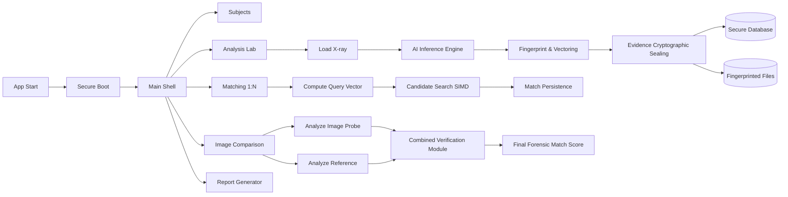
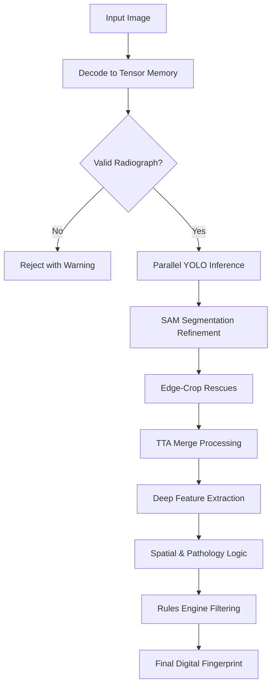

# الفصل الرابع: المعمارية التشغيلية والتحليل الخوارزمي المتقدم لمنظومة DentalID في الطب الشرعي السني

## 4.1 المقدمة
تُعرَّف منظومة **DentalID** كنظام طب شرعي سني مكتبي متكامل (Desktop Forensic Dental Application)، صُمم وفق أحدث معايير هندسة البرمجيات باستخدام تقنيات **.NET 8** ولغة **C#**، مع واجهة مستخدم تفاعلية مبنية على إطار **Avalonia UI** وفق نمط العرض الهيكلي (MVVM). تعتمد المنظومة في بنيتها التحليلية على سلسلة من نماذج التعلم العميق (ONNX Models) المخصصة للكشف والتحليل السني الدقيق.

لا تقتصر وظيفة المنظومة على كشف الأسنان والآفات المرتبطة بها فحسب، بل تمتد لتغطي دورة جنائية متكاملة (End-to-End Forensic Lifecycle). يشمل ذلك بروتوكولات الإقلاع الآمن، التحقق من نزاهة النماذج (Model Integrity)، التحليل الشعاعي الآلي المدعوم بمرشحات جنائية وقواعد اتساق بيولوجية، فضلاً عن استخراج بصمات رقمية سنية (هجينة بين الترميز الرمزي والمتجهي). وتدعم المنظومة عمليات المطابقة البيومترية والمقارنة الصورية ثنائية الأبعاد، مع ضمان أمن الأدلة من خلال الأختام الرقمية (Digital Seals) وتوليد تقارير رسمية بصيغة PDF قابلة للاعتماد القضائي.

---

## 4.2 المعمارية الهندسية للنظام (System Architecture)

### 4.2.1 التقسيم الطبقي (Clean Architecture)
اعتمد تصميم النظام على معمارية "النظيفة" (Clean Architecture) لضمان الفصل المنطقي بين الاهتمامات (Separation of Concerns)، وقابلية التوسع والصيانة. ينقسم النظام إلى أربع طبقات رئيسية:

1. **الكيانات الأساسية (Domain Layer - `DentalID.Core`):** تحتوي على الكيانات المركزية (Entities) مثل `Patient` و`DentalRecord`، بالإضافة إلى واجهات العقود (Interfaces)، ونماذج نقل البيانات (DTOs)، وتصنيفات البيانات (Enums). تتميز هذه الطبقة باستقلالها التام عن أي تفاصيل بنيوية أو خارجية.
2. **طبقة التطبيق (Application Layer - `DentalID.Application`):** تمثل قلب المنطق الإجرائي، وتحتوي على حالات الاستخدام المطلوبة مثل منطق التحليل، خوارزميات المطابقة، محركات الاستدلال العصبي الذكي، وقواعد تقييم الطب الشرعي المتقدمة.
3. **البنية التحتية (Infrastructure Layer - `DentalID.Infrastructure`):** تُعنى بتفاصيل التخزين والتقنيات الخارجية. تشمل مستودعات البيانات (Repositories) باستخدام EF Core وقواعد بيانات SQLite، وآليات التشفير الأمنية، ومعالجة وحفظ الملفات، بالإضافة إلى محركات توليد تقارير PDF.
4. **طبقة العرض (Presentation Layer - `DentalID.Desktop`):** واجهة المستخدم الرسومية المبنية بتقنية Avalonia UI، وتدار من خلال نماذج العرض (ViewModels) لإدارة التفاعل بين المستخدم ومنطق التطبيق بسلاسة وفعالية.

### 4.2.2 الخدمات الجوهرية للتحليل والاستدلال
تدير طبقة التطبيق مجموعة من الخدمات المركزية المتكاملة، أبرزها:
- `OnnxInferenceService`: واجهة موحدة (Facade) لإدارة دورة التحليل العصبي.
- `OnnxSessionManager`: لإدارة جلسات ONNX وضمان كفاءة أداء مزودات التنفيذ.
- `TeethDetectionService` و `PathologyDetectionService`: خدمات مخصصة لاكتشاف وتحديد مواقع الأسنان والآفات.
- `SamSegmentationService`: خدمة التقسيم الدقيق لاستخراج الحدود الشكلية (Outlines/Masks).
- `FeatureEncoderService`: لاستخلاص المتجهات الرقمية العميقة.
- `BiometricService`: لبناء الكود السني الجنائي الرمزي.
- `MatchingService`: لإدارة عمليات المطابقة المتجهية عالية الأداء (SIMD).
- `ForensicRulesEngine` و `ForensicHeuristicsService`: محركات مسؤولة عن تطبيق المنطق السريري وقواعد الاتساق الجنائية.

---

## 4.3 بروتوكول الإقلاع الآمن (Secure Boot Protocol)
لضمان موثوقية النظام قبل معالجة أي أدلة جنائية، يمر التطبيق بسلسلة من إجراءات الإقلاع الآمن عبر مُهيئ النظام (`Bootstrapper`):

1. **إدارة الإعدادات ومفاتيح الأمان:** تجميع إعدادات البيئة (الإنتاج أو التطوير)، وتوليد أو استرجاع مفاتيح الأمان الحتمية (`SealingKey`) من متغيرات البيئة أو التخزين الآمن.
2. **فحص نزاهة النماذج (Model Integrity):** يتم حساب خوارزمية التجزئة (SHA-256) لكل نموذج ذكاء اصطناعي مضمن، ومقارنته بالملف المرجعي (`model_integrity.json`) كشرط أساسي لمرور الإقلاع.
3. **تهيئة المحرك العصبي وإعداد قواعد البيانات:** تهيئة قاعدة بيانات SQLite وإجراء ترحيلات الهياكل المطلوبة، ثم اختبار النماذج العصبية وإعدادها للعمل ووضع النظام في حالة الجاهزية التامة.

---

## 4.4 إدارة دورة حياة الدليل وتدفق البيانات (Evidence Lifecycle)
تضمن الآلة الحالتية (State Machine) في معمارية النظام الانتقال المنطقي المنضبط للبيانات:
1. **Acquisition (الاستحواذ):** تحميل الصورة والتأكد من توافقها مع خصائص الصور الشعاعية لتجنب الأدلة المرفوضة مبكراً.
2. **Analysis (التحليل):** توليد الاكتشافات الأولية، ثم تنقيحها عبر خوارزميات إزالة التداخل (NMS) وتطبيق التقييمات الجنائية.
3. **Fingerprinting (البصمة):** توليد الشفرة الرمزية والمتجه الرقمي للأسنان المستخرجة.
4. **Sealing (الختم):** حساب الختم الرقمي وحفظ الدليل مع بياناته الوصفية بطريقة المعاملة الموحدة (Atomic Transaction).
5. **Reporting (التقارير):** إعداد الدليل ليكون جاهزاً لإصدار التقارير القانونية الموثقة.

---

## 4.5 خط أنابيب التحليل العصبي (AI Inference Pipeline)
يمثل التحليل العصبي العمود الفقري للنظام، ويمر بالمراحل الأكاديمية التالية:
1. **تجهيز التنسورات (Tensor Preparation):** ضبط أبعاد الصورة (Letterbox/Resize) وتطبيع قيمها اللونية في الذاكرة المباشرة (Unsafe Pointers) لتحسين كفاءة المعالجة وتقليل زمن الانتظار.
2. **الكشف المتوازي (Parallel Detection):** استخدام نماذج من عائلة YOLO لاكتشاف الأسنان (`TeethDetectionService`) والآفات (`PathologyDetectionService`) في آن واحد.
3. **التقسيم الدقيق عبر SAM:** إنتاج قوالب تحديد (Masks) وتفاصيل مورفولوجية (العرض، الطول، المساحة) للكيانات المكتشفة باستخدام نماذج هندسية مخصصة.
4. **التحسين والإنقاذ (Heuristics & Rescue):** تفعيل استراتيجيات لإنقاذ الاكتشافات الطرفية (Edge-Crop Rescue) وتطبيق تقنيات تحسين الزمن الفعلي (Test-Time Augmentation - TTA) لتعويض أي أخطاء زاوية أو إحداثية، مع دمج النتائج وإعادة فلترتها.
5. **ما بعد المعالجة (Post-Processing):** ربط الآفات بالأسنان مكانياً (Mapping)، وتطبيق محددات التعارض السريري (Forensic Rules Engine) لرفض الحالات المستحيلة طبياً (مثل ظهور تسوس في سن مزروع `Implant`).

---

## 4.6 استخراج البصمة الرقمية السنية (Digital Dental Fingerprint)
تتضمن البصمة السنية في المنظومة شقين متكاملين:

### 4.6.1 البصمة الرمزية (Symbolic Dental Code)
تستخرج خدمة `BiometricService` رمزيات معيارية وفق نظام (FDI) لتحديد حالة الأسنان بدقة (مثل `H` للسليم، `I` للزرع، و`C` للتيجان)، مع تخصيص "موزونات أهمية" (Uniqueness Scores) تبرز العلامات السريرية الأكثر تميزاً من الناحية الجنائية.

### 4.6.2 البصمة المتجهية العميقة (Deep Feature Vector)
يدمج النظام عبر `FeatureEncoderService` عدة فئات من السمات في متجه هجين ذو بُعد عالٍ يبلغ `1280` عنصراً، وينقسم كالتالي:
- `1024`: سمات عميقة (Deep Features) مستخرجة من SAM Encoder (عبر Mean-Pooling).
- `160`: سمات هندسية مكانية (`32` سناً × `5` متغيرات: ثقة، موقع x/y، أبعاد w/h).
- `96`: سمات مورفولوجية استخرجت عبر SAM (`32` سناً × `3` متغيرات).

---

## 4.7 عمليات المطابقة والمقارنة الجنائية
### 4.7.1 المطابقة واسعة النطاق (1:N Matching)
تُدار من خلال خوارزميات SIMD لضمان استهلاك أمثل للموارد، حيث يُحتسب تشابه جيب التمام (Cosine Similarity) بين متجه الصورة المجهولة `Probe` ومدخلات قواعد البيانات. تُعتمَد عتبات أمان (Calibration/Gamma) لتقليم النتائج وإرجاع أقرب الهويات المحتملة.

### 4.7.2 المقارنة المباشرة المحققة (1:1 Verification)
تجمع الجلسة التحليلية المقارنة (`ComparisonService`) بين السجلات المستخرجة وتُحسب النتيجة الجنائية المركبة (`Combined Forensic Score`) عبر دالة ترجيح تجمع بين الدلالات المتجهية الشاملة (`Vector Similarity`) وتطابق الآفات المجهرية (`Condition Match Score`) والحالة الكلية لمواضع الأسنان. توظّف المعادلات التالية كمقياس تقييمي:

$$ S_{combined} = 0.5 \cdot \max(0, S_{vector}) + 0.3 \cdot S_{condition} + 0.2 \cdot S_{presence} $$

---

## 4.8 الأمان الجنائي وحماية سلامة الأدلة
تلتزم المنظومة بمطالب الدفاعية الجنائية القانونية (Defensibility) عبر:
- **التشفير القوي:** تشفير بيانات القضايا والمعلومات الشخصية المستخرجة بخوارزميات `AES-256-CBC` مقترنة بتقنيات التوثيق `HMAC-SHA256` لضمان سريتها المكتسبة من طبقة البنية التحتية.
- **الأختام الرقمية (Digital Seals):** لضمان سلسلة الحيازة (Chain of Custody)، يُحتسب ختم رقمي للمعاملة يضم (صورة الدليل + ملف البيانات الوصفية JSON + رقم القضية). تعكس أي تعديلات لاحقة انهياراً في سلامة الختم يرفضه النظام آلياً.

---

## 4.9 الخاتمة
أثبتت الهيكلية التشغيلية والخوارزمية المتبعة لمنظومة **DentalID** متانة استثنائية في محاكاة الإجراءات المعقدة للطب الشرعي السني. من خلال تطبيق منهجية معمارية نظيفة، مدمجة بخطوط أنابيب الذكاء الاصطناعي متعددة الطبقات (Pipeline)، وتحت قيود أمنية سيبرانية جنائية صارمة لضمان موثوقية الهويات؛ يٌقدم النظام إطاراً أكاديمياً وتقنياً قابلاً للتطبيق في المحاكم ودوائر التحقيق الجنائي بحضور واسع وموثق.

---

## 4.10 الملحق: المخططات الهندسية الشاملة (Flowcharts)

### مخطط هندسة النظام الكلية (End-to-End System)

### مخطط خط الأنابيب العصبي للتحليل

